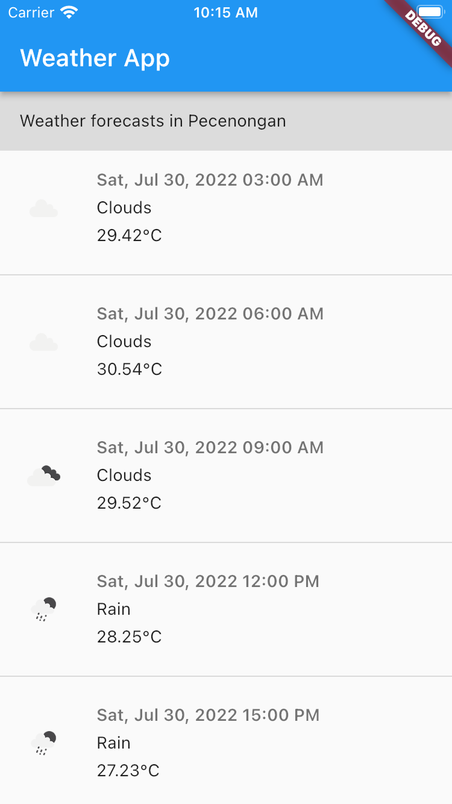
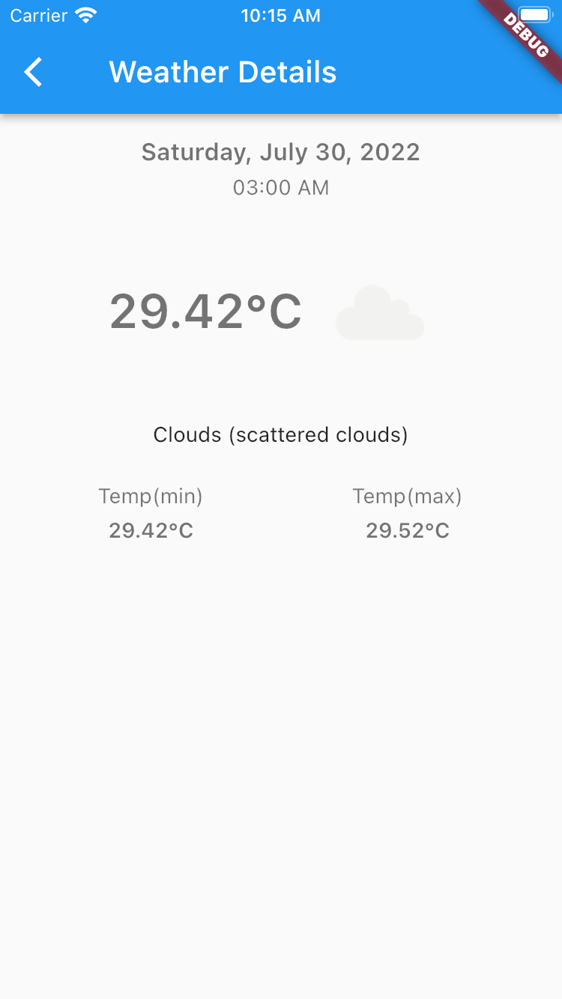

# Jhoan River Weather App

Jhoan River Weather App

## Getting Started

Weather forecast is an application to predict weather on particular location. by default I setup the location in Pacenongan.
latitude : -6.175115064391812 and longitude : 106.82708842419382. For weather data resouce i took it from https://openweathermap.org/
The default data prediction will be cover for 6 days later.

## Tools
 - Android Studio
 - Gradle 7.4.2
 - Flutter 3.0.3
 - Dart 2.17
 - Kotlin 11 above
 
 
## Notes
 - Because flutter has so much improvement in every updated version. I suggest you to make your tools similar to me or maybe you gonna get so much error for example : null safety handling, library version too high, etc.
 
 
 ## Installation
  - clean and rebuild project using 
  ```
  flutter clean
  flutter pub get
  ```
  
  - When the proccess completed without any error, you can start to run it it
  ```
  flutter run
  ```
## Codes

- Provider as State Management
- Get it as dependency injection
- http as api service
- provide low-level and high-level class.
- Provide simple unit test for api client


## Snaphot

- List Weather


- Detail

  
